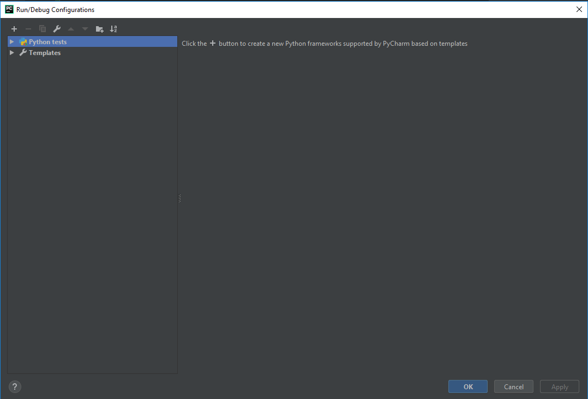
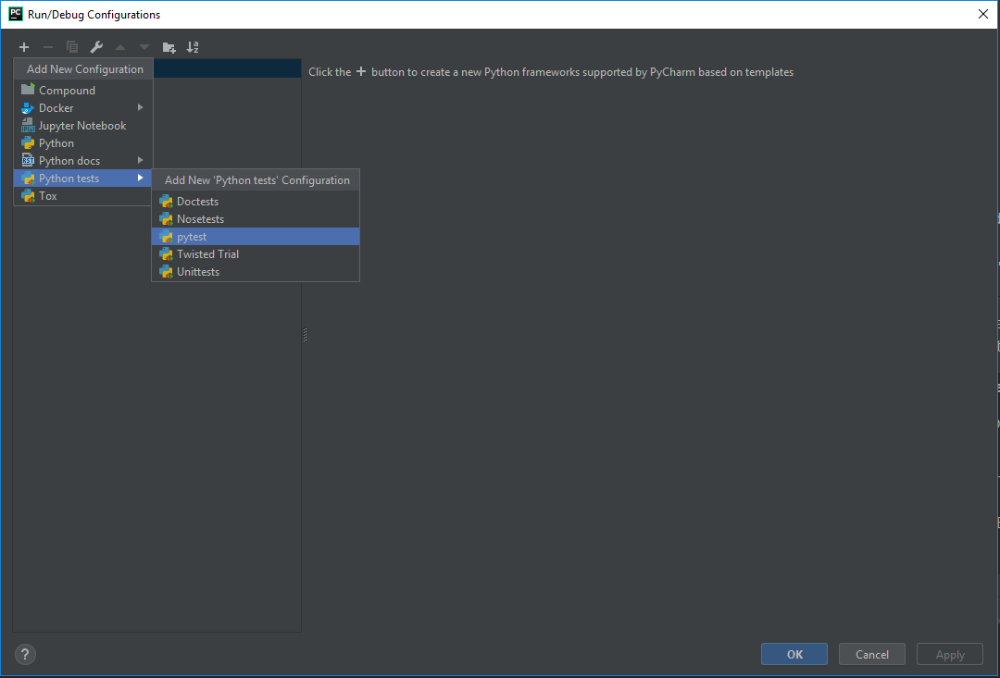
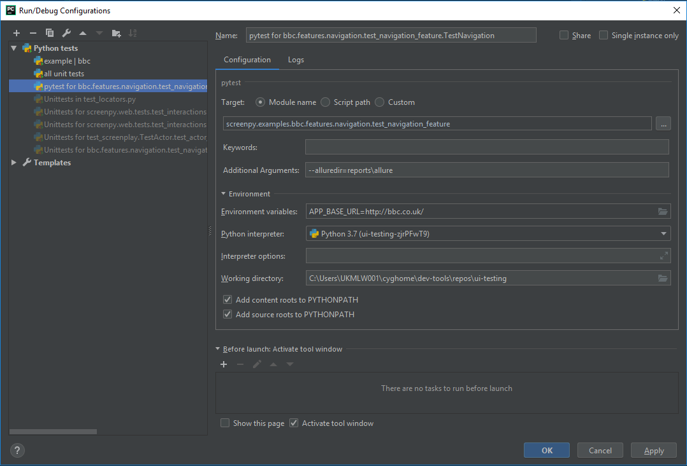
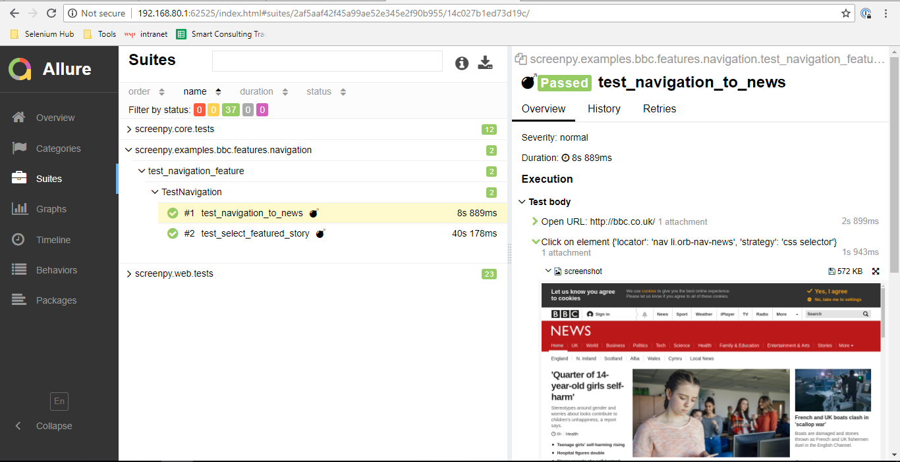

# ui-testing

screenpy (working title) is a testing framework that promotes a user-centric, behavioural way of testing that
brings to the forefront what the user is trying to accomplish.  It is primarily designed to be used in
conjunction with Selenium - however, the concepts apply to any user-behaviour-driven scenario and modules can
be used/not used as desired. 

The current resources allow you to launch a selenium grid and perform a basic test.  They require an
element of manual setup for them to work.

## Usage
This repo provides a friendlier way to write tests, based loosely upon [the screenplay pattern](https://serenity-js.org/design/screenplay-pattern.html).
It is primarily designed for use in conjunction with Selenium, but those modules are completely optional.

A simple test might look like


```python
class TestNavigation(TestCase):

    def setUp(self):
        self.eddy = Actor.called("eddy").who_can(BrowseTheWeb)
        self.eddy.attempts_to(OpenTheBBCWebsite())

    def test_navigation_to_news(self):
        self.eddy.attempts_to(
            Navigate.to_news()
        )

        heading = self.eddy.sees(
            Text.on(header.news)
        )

        self.assertEqual('BBC News', heading)

```


## Getting Started
### Download The Code
Clone this repo
```
git clone git@bitbucket.org:wspdigitaluk/ui-testing.git
```

### Launch the Selenium Grid
In a new terminal, launch a machine with docker installed and ensure that you can access the port 4444 from the host machine.
If doing this using the standard dev-tools vagrant machine, simply add another port-mapping to the `Vagrantfile`.
```commandline
cd <dev-tools-dir>
vagrant up
vagrant ssh
```
From the `ui-testing` directory, launch the containers.
```commandline
cd <ui-testing-dir>
docker-compose up
```
You should be able to see the output of the containers, including the node showing that it has connected to the hub.

### Verify the virtual environment
Ensure you have pipenv installed on your host machine.  If not, grab it with `pip install pipenv`.

From the repo directory, initialise the virtual environment
```commandline
pipenv install
```

To make use of the virtual environment inside an IDE, ensure that you have set the python interpreter to use
the one created as part of the pipenv initialisation.  See your IDE docs for more guidance on this. 

### Verify integrity of the code/environment
To check all the steps have run so far, kick the unit tests off by running
```commandline
pipenv run python -m pytest
```


## Understanding The Components
The framework is made up of a few key components.  Understanding their roles is key to developing an organised, SOLID
test suite.

### Actors
Actors are the focal-point of the framework.  Actors do three things:
1. Have [abilities](#Abilities)
2. [Interact](#Interactions) with things
3. Ask [questions](#Questions)

All of their actions can be modelled this way.  How each of these things work will become clear below.

Actors can be created using the fluent syntax

```python
from screenpy.core import Actor

hulk = Actor.called("Bruce Banner")
```

It's good to give your actors real names - it helps your brain to contextualise the information about that actor.

### Abilities
Abilities imbue the user with powers, allowing them to either interact with or ask questions about things.  For example,
one of the most common abilities is `BrowseTheWeb`.  This enables a user to interact with a web browser and ask
questions about the state of the browser.

Abilities can be assigned to actors using the `who_can` syntax

```python
from screenpy.core import Actor
from screenpy.web.abilities import BrowseTheWeb

snowden = Actor.called("Edward Snowden").who_can(BrowseTheWeb)
```

Abilities do not need to implement any special methods but _their constructor must take no arguments_ (other than `self`).

### Interactions
Interactions are the way that actors change their surroundings.  They are _enabled_ by abilities.

Two common interactions that are enabled by the `BrowseTheWeb` ability are `Open` and `Click` which will open a
URL and click on page elements, respectively.

```python
from screenpy.web.interactions import *
from my_module.pages import Home

snowden.attempts_to(
    Open("http://sweetmemes.com/"),
    Click.on(Home.refresh_meme)    
)
```

Interactions must implement the `perform_as(actor)` method.  The `perform_as` method must call `actor.ability_to(AbilityClass)`
before interacting with the system.

It is uncommon for actors to perform interactions - it is much more likely that they will attempt to perform 
tasks instead.

### Tasks
Tasks group interactions into sets that represent a task the user is trying to perform.  For example, the 
interaction scenario above represents the actor trying to refresh the meme displayed.

Tasks are a much more robust way of performing interactions as it means that when your application changes
so that a new meme refreshing mechanism exists - you only have to change your test code in one place.

On top of this, it means we can write out a test script really quickly by thinking about the behaviour of the
actor and writing this out in plain english.  The specifics of how a user does something can be worked out later.
This is essential in being able to write tests from the very beginning of the development cycle.

We can refactor our previous example to become
```python
class RefreshTheMeme:
    def __init__(self):
        self.interactions = [
            Open("http://sweetmemes.com/"),
            Click.on(Home.refresh_meme)
        ]
    
snowden.attempts_to(
    RefreshTheMeme()
)
```


Tasks must have an `interactions` attribute that returns an iterable containing the interactions to perform. 

### Questions
Questions are the mechanism through which actors _examine_ their surroudings.  The are subtely different from 
interactions in that they only perform observations i.e. they never change state of the system.

An example of a question would be the built-in question `Text`.  This question asks about the text displayed
on a web element.

```python
from screenpy.web.questions import *

snowden.sees(Text.on(Home.meme_title))
```

Questions must implement the `answered_by(actor)` method.  This method must call `actor.ability_to(AbilityClass)`
before interrogating the system. 

### Web-specific Components
#### Locators
Locators provide a convenient way of expressing how to find elements on a web page.  They abstract some of the
parameters that might otherwise be provided to the WebDriver instance into a more fluid syntax.

```python
from selenium.webdriver.common.by import By
from screenpy.web.locators import Locate
from screenpy.web.interactions import Click

# without locators
my_button_path = "//button[@id='but']"
Click.on(my_button_path).found(By.XPATH)

# with locators
my_button = Locate.by_xpath("//button[@id='but']")
Click.on(my_button)
``` 

The important part of this is that it combines the path and the location strategy into a single object.  The two are
dependent on each other and should be kept together to avoid nasty bugs creeping in.

#### Page Objects
Page objects are a familiar pattern to anyone who has tried UI testing before.  They are objects that represent
pages or sections of a page.  They contain information about the location of elements on the page
(and sometimes handle the interactions).

In this framework, they should be used simply as a housing for the [locators](#Locators).

It is advised that elements visually stay roughly in order of how they would appear on the page
or at least grouped with nearby elements.  This aids readability.


## Running the tests
The tests are designed to be executed using pytest.  This gives us a number of benefits, namely, the option to
add plugins to the test lifecycle.  If your tests are configured to use the built-in `unittest` module - they will
integrate seamlessly with the pytest runner.

### Via the command line
To run the tests via the command line, navigate to the root directory and run

```commandline
pipenv run python -m pytest
```

There are other options to run specific modules, as well as configuration options.  See the pytest docs for more.

### Via an IDE
Most of the development process is spent inside an IDE.  The pytest runner can be configured to run this way with
minimal setup.

The `conftest.py` file in the root of the project defines the plugins needed when pytest runs.  All pytest commands
should be run from this directory.

The following is an example of setting up the runner in PyCharm.  Other IDEs will require similar setup.

#### PyCharm
Open the Run Configuration menu by going to `Run > Edit Configurations...`


Click the + symbol to add a new configuration.  Select the pytest option.


Edit the settings to follow the pattern shwon below.

* Name = descriptive name of your choosing
* Target | Module name = Set the target of the pytest command to a specific module - in this example a test file
* Additional Arguments = Other arguments to pass to the runner.  This adds in the built-in reporting solution.
* Environment variables
* Python interpreter = The virtual environment created by pipenv
* Working directory = Root of the project

Hitting run on this configuration should launch the tests using the pytest configuration we have mandated.

## Reporting
The framework natively supports the [Allure](http://allure.qatools.ru/) reporting solution.  It's an open-source
tool for beautiful, configurable reports and it has a plugin for pytest.

To activate the reporting tool, set the `alluredir` flag on your test runner to an output folder.  It will default
to `/allure-reports`, or you can set it to whatever you want.

```commandline
pipenv run python -m pytest --alluredir=your/path/here
```

The built-in interactions all hook into the allure step definitions - providing you with more detailed results.


## Configuring The Browser Tests
There are a number of environment variables that can be set to change the browser used to execute the tests.

 | Variable | Description |
 |----------|-------------|
 | SELENIUM_HUB_ADDRESS | Changes the address for the selenium hub. |
 | SELENIUM_DRIVER_TYPE | Changes the type of browser requested e.g. 'chrome', 'firefox' |
 | SELENIUM_BROWSER_TIMEOUT | Number of seconds a browser session is allowed to hang while a WebDriver command is running |
 | SELENIUM_CLEANUP | Specifies how often (in ms) the hub will poll running proxies for timed-out (i.e. hung) threads |
 | SELENIUM_TIMEOUT | Specifies the timeout before the server automatically kills a session that hasn't had any activity in the last X seconds. The test slot will then be released for another test to use. This is typically used to take care of client crashes. For grid hub/node roles, cleanUpCycle must also be set. |
 | APP_BASE_URL | Specifies the base url to use to locate the app. e.g. http://bbc.co.uk/ |
 
 For more options, the easiest summary can be found in [this thread](https://stackoverflow.com/questions/43395659/properties-for-selenium-grid-hub-node-config)
 
### Default Configuration

#### Timeouts
##### Grid
The docker-compose file defining the grid sets some properties on the hub and nodes.  More information about what
environment variables match to each selenium configuration property can be found in the `Dockerfile`s of the images.

The nodes will shut down any browsers that have not received any commands for 60 seconds.  This helps as a fail safe
to ensure that sessions that hang due to driver/connection mishaps do not prevent the remainder of the tests from 
executing.

##### Drivers
The web drivers set an implicit wait time of 5 seconds.  In other words, whenever they try to load a page or find an
element on a page, they will wait for success for 5 seconds.  After this time, they will throw an error.